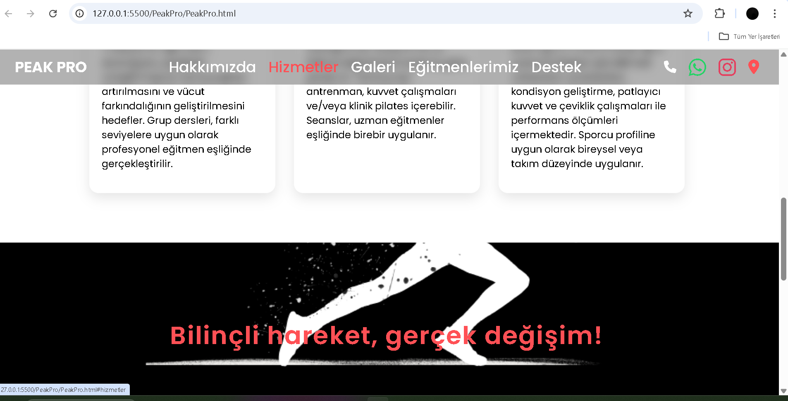
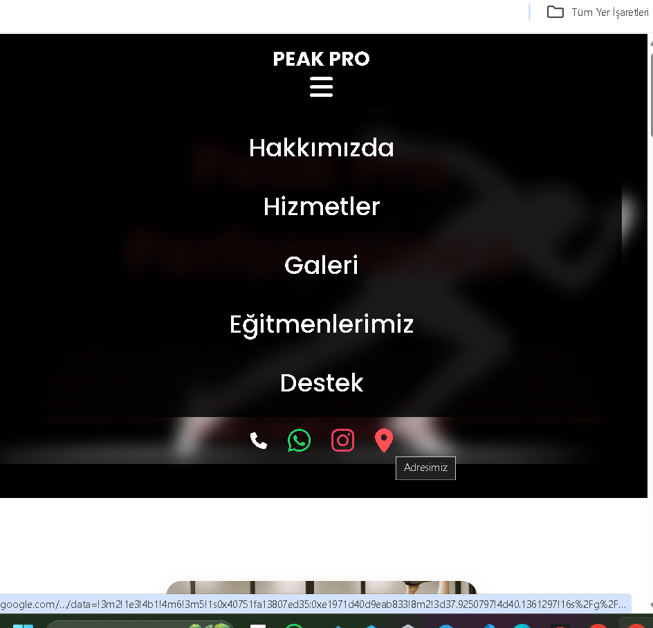

# Peak Pro Performance

## Proje Hakkında

Peak Pro Performance, responsive (duyarlı) ve modern tasarıma sahip bir web sitesi projesidir. Bu projede özellikle hamburger menü, farklı ekran boyutlarına uyum, kart yapıları ve iletişim formu gibi temel UI öğeleri uygulanmıştır. Tasarımda Google Fonts ve Font Awesome ikonları kullanılmıştır.(GELİŞTİRİLMEKTE OLAN BİR PROJEDİR)

---

## Ekran Görüntüleri (deneme1 branch'ına ait görsellerdir)

| Büyük Ekran                            | Küçük Ekran                           |
|----------------------------------------|---------------------------------------|
|               |           |

---

## Teknolojiler

- HTML5  
- CSS3 (Responsive Tasarım & Flexbox)  
- JavaScript (Hamburger Menü için basit toggle fonksiyonu)  (deneme1 branch'ında yapılan işlem)
- Google Fonts (Poppins)  
- Font Awesome (Sosyal ikonlar)

---

## Canlı Demo

Projeyi canlı olarak [buradan inceleyebilirsin](https://frabiakaynak.github.io/Peak-Pro-Performance/).

---

© 2025 Rabia Kaynak - Peak Pro Performance
